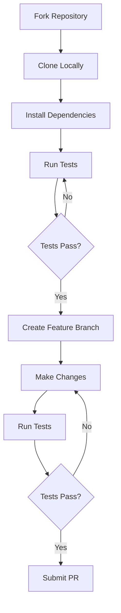

# Stellar::Erb


A safe, easy to use wrapper for ERB (Embedded Ruby) templates outside of Rails.


## Overview

Stellar::Erb provides a robust method for reading `.erb` files from disk and rendering them to strings, with built-in support for:
- Variable passing
- Error handling with context
- Clean backtraces
- Template reusability


## Installation

Add this line to your application's Gemfile:

```ruby
gem 'stellar-erb'
```

And then execute:

```bash
$ bundle install
```

Or install it yourself as:

```bash
$ gem install stellar-erb
```

## Usage

### Basic Template Rendering

```ruby
# template.erb
<h1>Hello, <%= name %>!</h1>
<ul>
  <% items.each do |item| %>
    <li><%= item %></li>
  <% end %>
</ul>

# Ruby code
result = Stellar::Erb::View.render('template.erb', 
  name: 'John', 
  items: ['apple', 'banana', 'orange']
)
```


#### Creating Reusable Views

```ruby
# Create a view instance for reuse
view = Stellar::Erb::View.new('templates/header.erb', 
  company_name: 'Acme Corp'
)

# Render multiple times with different locals
page1 = view.render(title: 'Home')
page2 = view.render(title: 'About')
```

#### Error Handling

```ruby
begin
  Stellar::Erb::View.render('template.erb', user: current_user)
rescue Stellar::Erb::Error => e
  puts "Error: #{e.message}"
  puts "\nContext:"
  puts e.context_lines.join("\n")
  puts "\nOriginal error: #{e.original_error.class}"
end
```


## Development

After checking out the repo, run `bin/setup` to install dependencies. Then, run `rake test` to run the tests. You can also run `bin/console` for an interactive prompt that will allow you to experiment.

Development workflow:



## Contributing

1. Fork it
2. Create your feature branch (`git checkout -b feature/my-new-feature`)
3. Commit your changes (`git commit -am 'Add some feature'`)
4. Push to the branch (`git push origin feature/my-new-feature`)
5. Create new Pull Request

## License

The gem is available as open source under the terms of the [MIT License](https://opensource.org/licenses/MIT).


## Support

For bug reports and feature requests, please use the [GitHub Issues](https://github.com/durableprogramming/stellar-erb/issues) page.

---

Stellar::Erb is actively maintained by [Durable Programming, LLC](https://github.com/durableprogramming).


Commercial support for Stellar::Erb and related tools is available from Durable Programming, LLC. You can contact us at [durableprogramming.com](https://www.durableprogramming.com).


