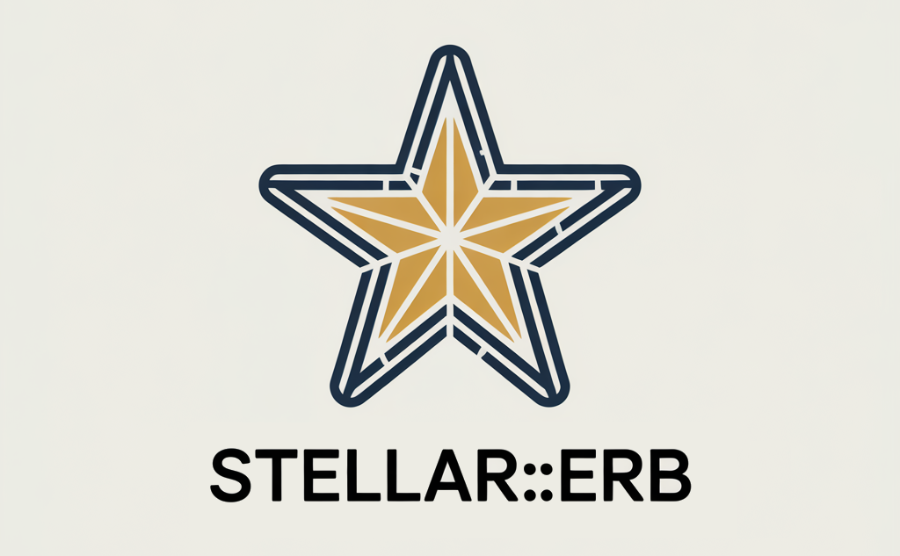
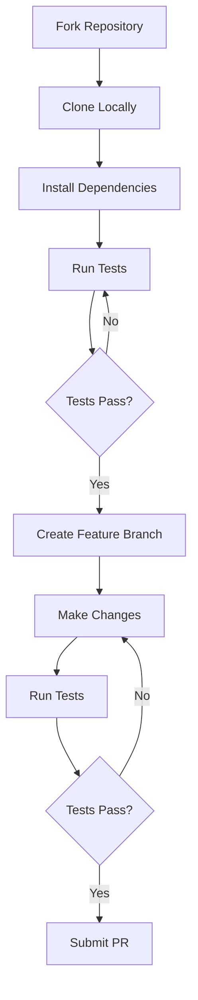

# Stellar::Erb



A robust, safe, and feature-rich wrapper for ERB (Embedded Ruby) template rendering outside of Rails.

## Overview

Stellar::Erb provides a sophisticated yet easy-to-use solution for working with ERB templates in Ruby applications. It offers enhanced error handling, clean backtraces, and a flexible API that makes template rendering both powerful and maintainable.

### Key Features

- **Safe Template Rendering**: Built-in protection against common template injection vulnerabilities
- **Rich Error Context**: Detailed error messages with line numbers and surrounding code context
- **Flexible Variable Passing**: Support for both global and per-render local variables
- **String Template Support**: Render ERB directly from strings in addition to files
- **Reusable Views**: Create view instances for efficient template reuse
- **Minimal Dependencies**: Works standalone without requiring Rails

## Installation

Add to your Gemfile:

```ruby
gem 'stellar-erb'
```

Or install directly:

```bash
$ gem install stellar-erb
```

## Usage

### Basic Template Rendering

```ruby
# template.erb
<div class="greeting">
  <h1>Hello, <%= name %>!</h1>
  <% if show_date %>
    <p>Today is <%= Date.today %></p>
  <% end %>
</div>

# Ruby code
result = Stellar::Erb.render('template.erb', 
  name: 'John',
  show_date: true
)
```

### String Template Rendering

```ruby
template_string = <<~ERB 
  <ul class="items">
    <% items.each do |item| %>
      <li><%= item.name %> - $<%= item.price %></li>
    <% end %>
  </ul>
ERB

result = Stellar::Erb.render_string(template_string, 
  items: [
    OpenStruct.new(name: 'Widget', price: 9.99),
    OpenStruct.new(name: 'Gadget', price: 19.99)
  ]
)
```

### Reusable Views

```ruby
# Create a reusable view instance
header = Stellar::Erb::View.new('partials/header.erb', 
  company: 'Acme Corp',
  logo_url: '/images/logo.png'
)

# Render with different page-specific variables
page1 = header.render(title: 'Home Page')
page2 = header.render(title: 'About Us')
```

### Error Handling

```ruby
begin
  result = Stellar::Erb::View.render('template.erb', user: current_user)
rescue Stellar::Erb::Error => e
  puts "Template Error: #{e.message}"
  
  # Show context around the error
  puts "\nError Context:"
  puts e.context_lines.join("\n")
  
  # Access original error details
  puts "Line Number: #{e.line_number}"
  puts "Template Path: #{e.template_path}"
end
```


## Development

```bash
# Setup development environment
bin/setup

# Run tests
rake test

# Run specific test file
ruby -Ilib:test test/stellar/erb/view_test.rb

# Generate documentation
yard doc
```

## Contributing

1. Fork the repository
2. Create your feature branch (`git checkout -b feature/amazing-feature`)
3. Add tests for your changes
4. Make your changes
5. Ensure tests pass (`rake test`)
6. Commit your changes (`git commit -am 'Add amazing feature'`)
7. Push to the branch (`git push origin feature/amazing-feature`)
8. Create a Pull Request

### Development Workflow



## License

Released under the MIT License. See [LICENSE](LICENSE) for details.

## Support

- **Documentation**: [RubyDoc](https://www.rubydoc.info/gems/stellar-erb)
- **Issues**: [GitHub Issues](https://github.com/durableprogramming/stellar-erb/issues)
- **Discussions**: [GitHub Discussions](https://github.com/durableprogramming/stellar-erb/discussions)

## Commercial Support

Professional support, custom development, and training services are available from [Durable Programming, LLC](https://www.durableprogramming.com).

---

[](https://github.com/durableprogramming/stellar-erb/actions/workflows/main.yml)
[](https://badge.fury.io/rb/stellar-erb)
[](LICENSE)
